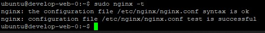

### Задание 1

1. Возьмите из [демонстрации к лекции готовый код](https://github.com/netology-code/ter-homeworks/tree/main/04/demonstration1) для создания ВМ с помощью remote модуля.
2. Создайте 1 ВМ, используя данный модуль. В файле cloud-init.yml необходимо использовать переменную для ssh ключа вместо хардкода. Передайте ssh-ключ в функцию template_file в блоке vars ={} .
Воспользуйтесь [**примером**](https://grantorchard.com/dynamic-cloudinit-content-with-terraform-file-templates/). Обратите внимание что ssh-authorized-keys принимает в себя список, а не строку!
3. Добавьте в файл cloud-init.yml установку nginx.
4. Предоставьте скриншот подключения к консоли и вывод команды ```nginx -t```.

------

Ответ:

<p align="center">
  
</p>

### Задание 2

1. Напишите локальный модуль vpc, который будет создавать 2 ресурса: **одну** сеть и **одну** подсеть в зоне, объявленной при вызове модуля. например: ```ru-central1-a```.
2. Модуль должен возвращать значения vpc.id и subnet.id
3. Замените ресурсы yandex_vpc_network и yandex_vpc_subnet, созданным модулем.
4. Сгенерируйте документацию к модулю с помощью terraform-docs.    
 
Пример вызова:
```
module "vpc_dev" {
  source       = "./vpc"
  env_name     = "develop"
  zone = "ru-central1-a"
  cidr = "10.0.1.0/24"
}
```
Ответ:

## Requirements

| Name | Version |
|------|---------|
| <a name="requirement_terraform"></a> [terraform](#requirement\_terraform) | >=0.13 |

## Providers

| Name | Version |
|------|---------|
| <a name="provider_yandex"></a> [yandex](#provider\_yandex) | n/a |

## Modules

No modules.

## Resources

| Name | Type |
|------|------|
| [yandex_vpc_network.vpc](https://registry.terraform.io/providers/yandex-cloud/yandex/latest/docs/resources/vpc_network) | resource |
| [yandex_vpc_subnet.subnet](https://registry.terraform.io/providers/yandex-cloud/yandex/latest/docs/resources/vpc_subnet) | resource |

## Inputs

| Name | Description | Type | Default | Required |
|------|-------------|------|---------|:--------:|
| <a name="input_subnet_cidr_block"></a> [subnet\_cidr\_block](#input\_subnet\_cidr\_block) | n/a | `string` | n/a | yes |
| <a name="input_subnet_name"></a> [subnet\_name](#input\_subnet\_name) | n/a | `string` | n/a | yes |
| <a name="input_vpc_name"></a> [vpc\_name](#input\_vpc\_name) | n/a | `string` | n/a | yes |
| <a name="input_zone"></a> [zone](#input\_zone) | n/a | `string` | n/a | yes |

## Outputs

| Name | Description |
|------|-------------|
| <a name="output_subnet_id"></a> [subnet\_id](#output\_subnet\_id) | n/a |
| <a name="output_vpc_id"></a> [vpc\_id](#output\_vpc\_id) | n/a |


### Задание 3
1. Выведите список ресурсов в стейте.
2. Удалите из стейта модуль vpc.
3. Импортируйте его обратно. Проверьте terraform plan - изменений быть не должно.
Приложите список выполненных команд и вывод.

Ответы:

1) Выводим state

```shell
root@ubnt2004:~/terraform_dz/hw-04/src# terraform state list
data.template_file.cloudinit
module.test-vm.data.yandex_compute_image.my_image
module.test-vm.yandex_compute_instance.vm[0]
module.vpc.yandex_vpc_network.vpc
module.vpc.yandex_vpc_subnet.subnet
root@ubnt2004:~/terraform_dz/hw-04/src# terraform state show module.vpc.yandex_vpc_subnet.subnet
# module.vpc.yandex_vpc_subnet.subnet:
resource "yandex_vpc_subnet" "subnet" {
    created_at     = "2023-04-04T13:44:17Z"
    folder_id      = "b1g6gbel0fuvh4bluqp4"
    id             = "e9baa8kahb7ojc0rc75i"
    labels         = {}
    name           = "first-subnet"
    network_id     = "enphb6sgfe595it6h9ij"
    v4_cidr_blocks = [
        "10.0.1.0/24",
    ]
    v6_cidr_blocks = []
    zone           = "ru-central1-a"
}
```

2) Смотрим модель network

```shell
root@ubnt2004:~/terraform_dz/hw-04/src# terraform state show module.vpc.yandex_vpc_network.vpc
# module.vpc.yandex_vpc_network.vpc:
resource "yandex_vpc_network" "vpc" {
    created_at = "2023-04-04T13:44:16Z"
    folder_id  = "b1g6gbel0fuvh4bluqp4"
    id         = "enphb6sgfe595it6h9ij"
    labels     = {}
    name       = "first-vpc"
    subnet_ids = []
}
```

3) Удаляем VPC и Subnet

```shell
root@ubnt2004:~/terraform_dz/hw-04/src# terraform state rm 'module.vpc.yandex_vpc_subnet.subnet'
Removed module.vpc.yandex_vpc_subnet.subnet
Successfully removed 1 resource instance(s).
root@ubnt2004:~/terraform_dz/hw-04/src# terraform state rm 'module.vpc.yandex_vpc_network.vpc'
Removed module.vpc.yandex_vpc_network.vpc
Successfully removed 1 resource instance(s).
root@ubnt2004:~/terraform_dz/hw-04/src# terraform state list
data.template_file.cloudinit
module.test-vm.data.yandex_compute_image.my_image
module.test-vm.yandex_compute_instance.vm[0]
```

4) Импортируем через id всё назад

```shell
root@ubnt2004:~/terraform_dz/hw-04/src# terraform import 'module.vpc.yandex_vpc_subnet.subnet' e9baa8kahb7ojc0rc75i
data.template_file.cloudinit: Reading...
data.template_file.cloudinit: Read complete after 0s [id=84f30ef5da043b3e360bd9a9f2b7535685e78e28ce6a956af30a2d19bb3911d2]
module.vpc.yandex_vpc_subnet.subnet: Importing from ID "e9baa8kahb7ojc0rc75i"...
module.test-vm.data.yandex_compute_image.my_image: Reading...
module.vpc.yandex_vpc_subnet.subnet: Import prepared!
  Prepared yandex_vpc_subnet for import
module.vpc.yandex_vpc_subnet.subnet: Refreshing state... [id=e9baa8kahb7ojc0rc75i]
module.test-vm.data.yandex_compute_image.my_image: Read complete after 1s [id=fd8tckeqoshi403tks4l]

Import successful!

The resources that were imported are shown above. These resources are now in
your Terraform state and will henceforth be managed by Terraform.
root@ubnt2004:~/terraform_dz/hw-04/src# terraform import 'module.vpc.yandex_vpc_network.vpc' enphb6sgfe595it6h9ij
data.template_file.cloudinit: Reading...
data.template_file.cloudinit: Read complete after 0s [id=84f30ef5da043b3e360bd9a9f2b7535685e78e28ce6a956af30a2d19bb3911d2]
module.vpc.yandex_vpc_network.vpc: Importing from ID "enphb6sgfe595it6h9ij"...
module.vpc.yandex_vpc_network.vpc: Import prepared!
  Prepared yandex_vpc_network for import
module.vpc.yandex_vpc_network.vpc: Refreshing state... [id=enphb6sgfe595it6h9ij]
module.test-vm.data.yandex_compute_image.my_image: Reading...
module.test-vm.data.yandex_compute_image.my_image: Read complete after 1s [id=fd8tckeqoshi403tks4l]

Import successful!

The resources that were imported are shown above. These resources are now in
your Terraform state and will henceforth be managed by Terraform.
```

5) Смотрим state

```shell
root@ubnt2004:~/terraform_dz/hw-04/src# terraform state list
data.template_file.cloudinit
module.test-vm.data.yandex_compute_image.my_image
module.test-vm.yandex_compute_instance.vm[0]
module.vpc.yandex_vpc_network.vpc
module.vpc.yandex_vpc_subnet.subnet
```

6) Делаем plan

```shell
root@ubnt2004:~/terraform_dz/hw-04/src# terraform plan
data.template_file.cloudinit: Reading...
data.template_file.cloudinit: Read complete after 0s [id=84f30ef5da043b3e360bd9a9f2b7535685e78e28ce6a956af30a2d19bb3911d2]
module.test-vm.data.yandex_compute_image.my_image: Reading...
module.vpc.yandex_vpc_network.vpc: Refreshing state... [id=enphb6sgfe595it6h9ij]
module.test-vm.data.yandex_compute_image.my_image: Read complete after 1s [id=fd8tckeqoshi403tks4l]
module.vpc.yandex_vpc_subnet.subnet: Refreshing state... [id=e9baa8kahb7ojc0rc75i]
module.test-vm.yandex_compute_instance.vm[0]: Refreshing state... [id=fhmetqr8r0ji76dh5hg2]

No changes. Your infrastructure matches the configuration.
```